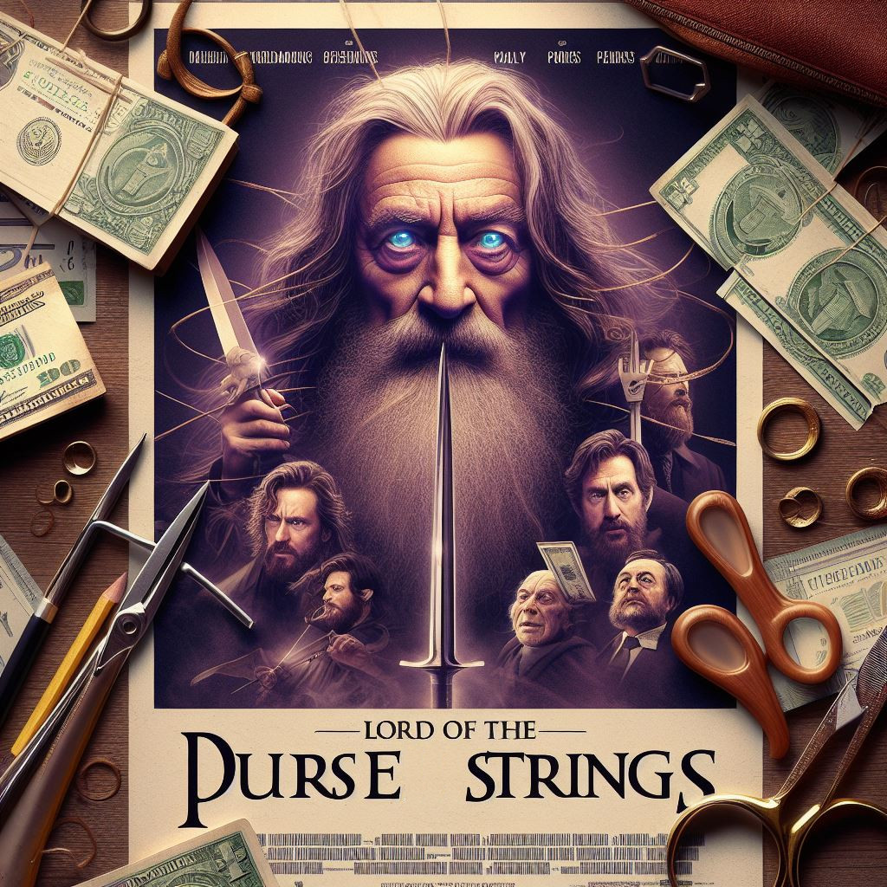

<aside class="notes">
<ul>
<li>The story of some noble individuals, making mistakes and learning from them</li>
</ul>
</aside>

---

## Graeme the Grey

<aside class="notes">
<ul>
<li>The story of some noble individuals, making mistakes and learning from them</li>
</ul>
</aside>

